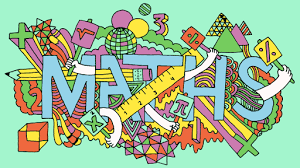

<h1>Sorting Algorithms</h1>

There are 3 sorts of sorting algorithm:
 - Bubble sort
 - Shuttle sort
 - First fit (decreasing)
 
<h2>Bubble sort:</h2>

1) Compare 1st 2 items and swap if necessary.

2) Move on to thee 2nd and the 3rd and keep going until you reach the end of gthe list.

3) Repeat from the beginning but you don't need to compare the last item as it's already in the right place.

4) Keep doing this operation, missing the previous last item until the pass has no comparisons or you only have one item left.

<h2>Shuttle sort:</h2>

1) Compare 1st and 2nd items and swap if necessary.

2) Compare the 3rd and 2nd items then the 2nd and 1st items and swap if necessary.

3) Continue this way until all items have been considered (kth pass considers k and k+1, then k and k-1 and so on until 2nd and 1st items considered or no swaps necessary).

<h2>First fit (decreasing):</h2>

1) If first fit decreasing, sort list into decreasing order else, leave as is.

2) Take 1st item and place into 1st box it fits in.

3) Continue this way until all items are in the boxes.

Efficiency = run time

Size = complexity

Order = efficiency in terms of size

Both bubble sort and shuttle sort are of quadratic order so the maximum number of swaps = (n-1)n/2

<button type="button"
onclick="document.getElementById('demo').innerHTML = Date()">
Click me to display Date and Time.</button>

Click the button to demonstrate the prompt box.

<button onclick="myFunction()">Try it</button>

